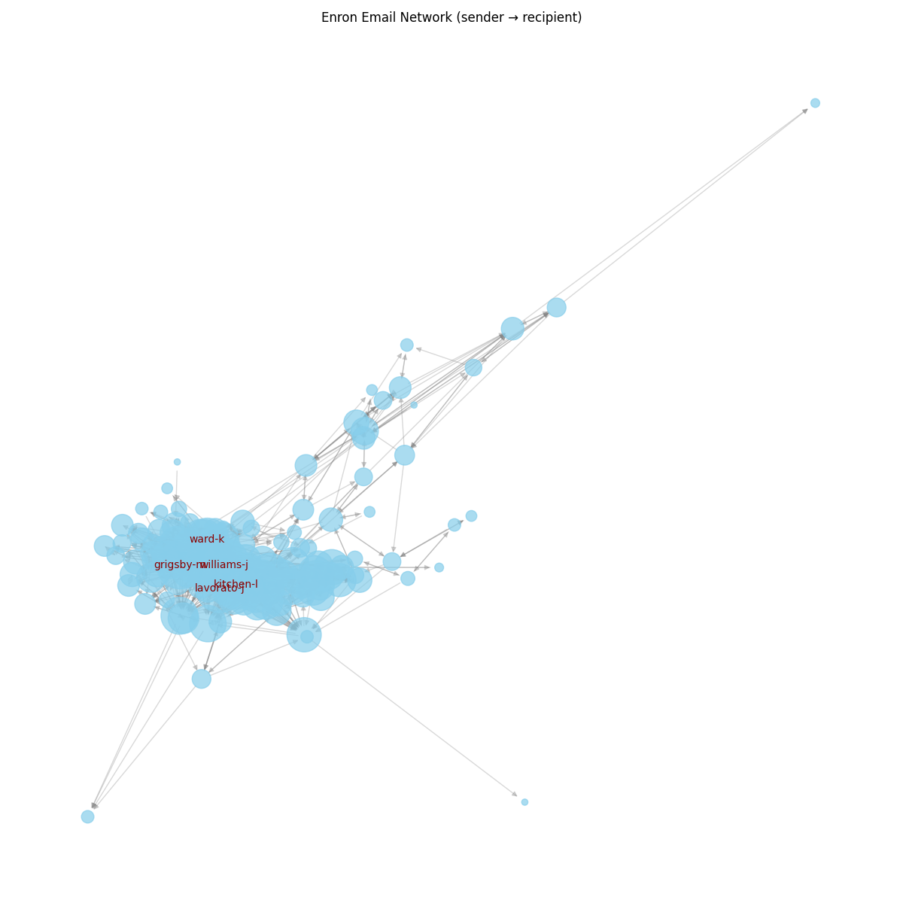
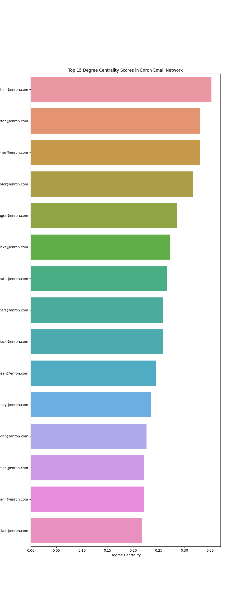

## Introduction

The Enron Email Dataset comprises approximately 500,000 emails from around 6000 Enron employees, primarily executives, spanning 1998 to 2002. Released during the FERC investigation into Enron's collapse

## Overview

This project aims analyzes the communication network within Enron Corporation using email data, focusing on identifying key employees and understanding their communication patterns. By uncovering structural patterns and potential anomalies in corporate communication, the goal is to better understand how such networks operate—and how similar analyses could help detect and prevent future corporate scandals.

## Network Visualization
<figure>
  
  <figcaption>Figure 1. Enron email network: node size ∝ number of unique contacts.</figcaption>
</figure>

The network visualization shows the communication patterns between Enron employees. Each node represents an employee, and each edge represents an email communication. The visualization highlights the most active communicators in the network.

## Methodology

### Data Collection and Preprocessing
The analysis is based on the Enron Email Dataset, which contains approximately 500,000 internal emails from around 6000 Enron employees spanning 1998 to 2002. The dataset was released by the Federal Energy Regulatory Commission (FERC) during investigations into Enron's collapse.

### Data Cleaning Pipeline
To create a high-quality network for analysis, we implemented a rigorous data cleaning process:

1. **Initial Filtering**
   - Removed incomplete records (emails missing sender, recipient, subject, or body)
   - Eliminated malformed or empty messages
   - Resulted in removal of 21.54% of the original dataset

2. **Automated Traffic Removal**
   - Filtered out system-generated emails and broadcast lists
   - Removed messages from automated sources (payroll, distribution lists, announcements)
   - Excluded "team.*" groups and similar automated channels

3. **Communication Network Refinement**
   - Removed self-sent emails
   - Limited analysis to employees with significant communication activity
   - Applied threshold of minimum 100 sent and received emails per employee

### Network Analysis
The cleaned dataset was analyzed using the following tools and metrics:

- **Network Construction**: Built using NetworkX library
- **Centrality Measures**: 
  - Degree centrality
  - Betweenness centrality
  - Closeness centrality
  - Community detection
- **Visualization**: Created using nxviz and matplotlib
- **Statistical Analysis**: Conducted using pandas and numpy

### Final Dataset Characteristics
After preprocessing:
- **Active Employees**: 222
- **Total Email Connections**: 78,458
- **Time Period**: 1998-2002

## Key Findings
Centrality scores quantify the importance or influence of a node within a network based on its position and connections. After calculating these scores for the Enron employees, we found that Sara Shackleton, Tana Jones, and Mark Taylor, Louise Kitchens and Elizabeth Sager emerged as the most central figures in the communication network.
<figure>
  
  <figcaption>Figure 1. Enron email network: node size ∝ number of unique contacts.</figcaption>
</figure>

### Most Central Communicators
The following employees were identified as the most central in the communication network:

1. [Sara Shackleton, President for Enron North America]
2. [Tana Jones, Negotiator at Enron Capital and Trade Resources ]
3. [Louise Kitchens, COO]
4. [Mark Taylor, Vice President]
5. [Elizabeth Sager, Chief Lawyer 5]

## Betweenness Score

Betweenness centrality measures how often a node appears on the shortest paths between other nodes, indicating its role as a bridge within the network. While many familiar names reappear in this ranking, a new key figure—Sally Beck—also emerges, highlighting her strategic position in the flow of information.
<figure>
  
  <figcaption>Figure 1. Enron email network: node size ∝ number of unique contacts.</figcaption>
</figure>

## Community Detection

In social networks, community detection helps identify groups of nodes that are more densely connected to each other than to the rest of the network—often reflecting organizational units or shared functions. In the Enron dataset, we detected 5 distinct communities, each representing clusters of employees with strong internal communication ties.

### Network Statistics

  

    
[Number]

    
Total Employees

  

  

    
[Number]

    
Email Connections

  

  

    
[Number]

    
Avg. psyko

  

The analysis focused on identifying key communicators and understanding communication patterns within the organization, with particular attention to the network structure and individual influence within the corporate hierarchy.

## Data Source
The analysis is based on the Enron email dataset, which contains internal communications from Enron Corporation.

## Code
The analysis code is available in the [GitHub repository](https://github.com/yourusername/enron-network-analysis).

  <h2> Contact</h2>
  
This project was made by Christian Warburg s225083 and Sofus Carstens s22for the Course Computational Social Science  .

