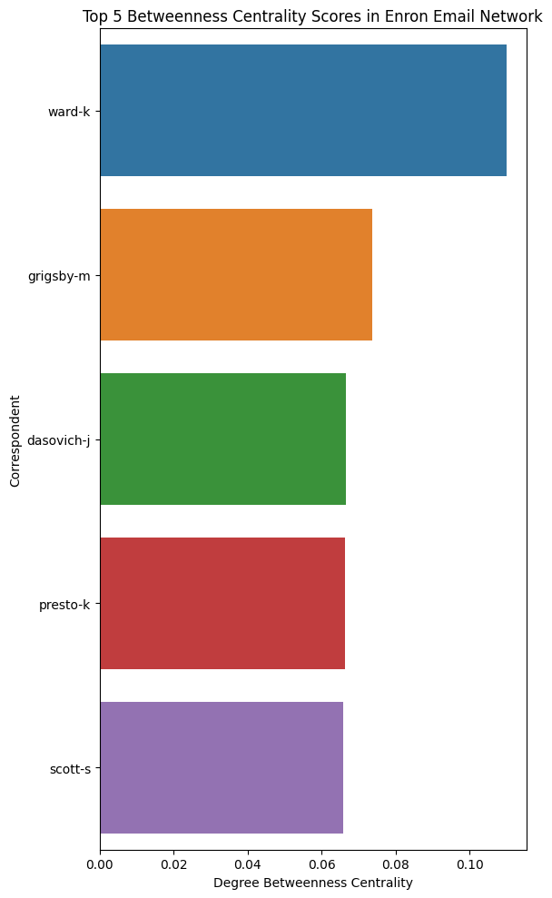

<header>
  <h1>Enron Network Analysis</h1>
  
Exploring the Enron dataset with Natural Language Processing

</header>

## Introduction

The Enron Email Dataset contains roughly half a million messages exchanged among some 6,000 employees—mostly senior executives—between 1998 and 2002. Originally released during the FERC inquiry into Enron’s collapse, it offers an unparalleled glimpse into the everyday communications and decision-making of a major corporation at a pivotal moment in history.

In this project, we focus on the subset of 150 executive-level employees, transforming their email traffic into a directed social network. By examining this network’s structure and evolution, we aim to surface communication patterns that might signal emerging crises. We then layer in Natural Language Processing—tracking sentiment and topic shifts over time—to explore whether early warning signs of malfeasance can be detected before it’s too late.

---

## Network Analysis

<figure class="network-visualization">
  
  <figcaption>Figure 1. Graph of the complete network of all executives.</figcaption>
</figure>

*Figure 1. Graph of the complete network of all executives.*

  

    
140

    
Active Employees

  

  

    
16000

    
Emails

  

  

    
18.93

    
Average Degree

  

To uncover the key players and structural dynamics within Enron’s executive communication network, we apply three complementary techniques:

1. **Centrality Measures**  
   - **Eigenvector Centrality** identifies nodes connected to other highly influential nodes, highlighting executives whose reach extends through the network’s most powerful hubs.  
   - **Degree Centrality** (in- and out-degree) reveals who sends the most messages and who receives the most, offering a quantitative measure of activity and visibility.  

2. **Betweenness Centrality**  
   Betweenness quantifies how often a node lies on the shortest paths between pairs of others. High-betweenness individuals serve as “bridges” or information bottlenecks—critically positioned to control the flow of knowledge or to detect and potentially obscure sensitive topics.

3. **Community Detection**  
   By partitioning the network into tightly connected groups (or communities), we can spot clusters of executives who communicate more frequently among themselves than with the broader organization. This helps us identify functional teams, informal cliques, or potentially siloed groups that may harbor distinct conversational norms or secretive exchanges.

Together, these methods allow us to pinpoint not only the most influential or active individuals but also the structural gateways and subgroups that shape information flow—and potentially conceal it—within Enron’s executive ranks.  

### Centrality Scores

Below we compare the top 5 nodes by **degree centrality** and **eigenvector centrality** side by side to highlight the most connected and most influential communicators.

### Centrality Scores

| **Degree Centrality** | **Eigenvector Centrality** |
| ---------------------- | -------------------------- |
|   
  *Figure 1. Top 5 Degree Centrality Scores.* |   
  *Figure 2. Top 5 Eigenvector Centrality Scores.* |

### Betweenness Score

Betweenness centrality shows which employees act as bridges on the shortest paths between others—key for detecting information bottlenecks.

<figure class="network-visualization">
  
  <figcaption>Figure Y. Nodes with highest betweenness.</figcaption>
</figure>

### Community Detection

Using the Louvain algorithm, we identified six distinct communities in the Enron executive network. The node with the highest degree centrality was John Lavorato, Enron’s COO. Intriguingly, his community also included Kenneth Lay and Jeffrey Skilling—both of whom were later convicted of fraud and insider trading and served prison sentences.

---

## Further Investigation and NLP

In this part, we want to determine if the the sentiment of Kenneth Lay and J. Skilling’s changed during the collapse of enron.

---

## Data Sources

The dataset can be downloaded from [Kaggle](https://www.kaggle.com/datasets/rcmonteiro/structured-enron-dataset/data).

## Contact

  <h2>Contact</h2>
  
This project was made by Christian Warburg (s225083) and Sofus Carstens (s22…) for the Computational Social Science course.

