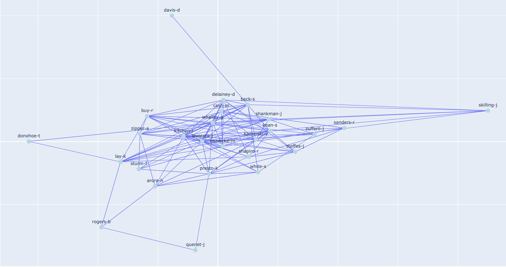

<header>
  <h1>Enron Network Analysis</h1>
  
Exploring the Enron dataset with Natural Language Processing

</header>

## Introduction

The Enron Email Dataset contains roughly half a million messages exchanged among some 6,000 employees—mostly senior executives—between 1998 and 2002. Originally released during the FERC inquiry into Enron’s collapse, it offers an unparalleled glimpse into the everyday communications and decision-making of a major corporation at a pivotal moment in history.

In this project, we focus on the subset of 150 executive-level employees, transforming their email traffic into a directed social network. By examining this network’s structure and evolution, we aim to surface communication patterns that might signal emerging crises. We then layer in Natural Language Processing—tracking sentiment and topic shifts over time—to explore whether early warning signs of malfeasance can be detected before it’s too late.

---

## Network Analysis

<figure class="network-visualization">
  
  <figcaption>Figure 1. Graph of the complete network of all executives.</figcaption>
</figure>

*Figure 1. Graph of the complete network of all executives.*

  

    
140

    
Active Employees

  

  

    
16000

    
Emails

  

  

    
18.93

    
Average Degree

  

To uncover the key players and structural dynamics within Enron’s executive communication network, we apply three complementary techniques:

1. **Centrality Measures**  
   - **Eigenvector Centrality** identifies nodes connected to other highly influential nodes, highlighting executives whose reach extends through the network’s most powerful hubs.  
   - **Degree Centrality** (in- and out-degree) reveals who sends the most messages and who receives the most, offering a quantitative measure of activity and visibility.  

2. **Betweenness Centrality**  
   Betweenness quantifies how often a node lies on the shortest paths between pairs of others. High-betweenness individuals serve as “bridges” or information bottlenecks—critically positioned to control the flow of knowledge or to detect and potentially obscure sensitive topics.

3. **Community Detection**  
   By partitioning the network into tightly connected groups (or communities), we can spot clusters of executives who communicate more frequently among themselves than with the broader organization. This helps us identify functional teams, informal cliques, or potentially siloed groups that may harbor distinct conversational norms or secretive exchanges.

Together, these methods allow us to pinpoint not only the most influential or active individuals but also the structural gateways and subgroups that shape information flow—and potentially conceal it—within Enron’s executive ranks.  

### Centrality Scores

Below we compare the top 5 nodes by **degree centrality** and **eigenvector centrality** side by side to highlight the most connected and most influential communicators.

### Centrality Scores

Below we compare the top 5 nodes by **degree** and **eigenvector** centralities side by side.

<table>
  <tr>
    <td align="center" valign="top">
      <figure>
         
        <figcaption><em>Figure 2.</em> Top 5 Degree Centrality Scores.</figcaption>
      </figure>
    </td>
    <td align="center" valign="top">
      <figure>
         
        <figcaption><em>Figure 3.</em> Top 5 Eigenvector Centrality Scores.</figcaption>
      </figure>
    </td>
  </tr>
</table>

#### Sub‐section: Centrality Insights

Both charts highlight **kitchen-l** and **lavorato-j** as the network’s primary hubs—high‐volume communicators whose partners are also highly connected. The swap between **ward-k** (high message count) and **whalley-g** (strategically influential ties) in the fourth spot illustrates that sheer activity (degree) doesn’t always equate to influence (eigenvector). Overall, combining these measures reveals both the busiest and the most impactful actors in Enron’s executive email network.

### Betweenness Score

Betweenness centrality shows which employees act as bridges on the shortest paths between others—key for detecting information bottlenecks.

<figure class="network-visualization" style="max-width: 600px; margin: 2rem auto;">
  
  <figcaption>Figure 4. Nodes with highest betweenness.</figcaption>
</figure>

#### Betweenness Centrality Insights

The betweenness chart highlights **ward-k** as the primary “bridge” in the network—positioned on the most shortest paths between executives. Following him, **grigsby-m**, **dasovich-j**, **presto-k**, and **scott-s** also serve as key intermediaries. These individuals are crucial for information flow, acting as gatekeepers who connect otherwise distant clusters within Enron’s executive communications.  

### Community Detection

Using the Louvain algorithm, we identified six distinct communities in the Enron executive network. The node with the highest degree centrality was John Lavorato, Enron’s COO. Intriguingly, his community also included [Kenneth Lay ](https://en.wikipedia.org/wiki/Kenneth_Lay )and [Jeffrey Skilling](https://en.wikipedia.org/wiki/Jeffrey_Skilling)—both of whom were later convicted of fraud and insider trading and served prison sentences.
<figure class="network-visualization" style="max-width: 600px; margin: 2rem auto;">
  
  <figcaption>Figure 4. Nodes with highest betweenness.</figcaption>
</figure>

---

## Further Investigation and NLP

In this part, we want to determine if the sentiment of Kenneth Lay and J. Skilling’s emails changed during the collapse of Enron.

---

## Sentiment Analysis Over Time

Sentiment analysis is the process of automatically determining whether a piece of text expresses a positive, negative, or neutral attitude. By scoring the emotional tone of written language, it lets us quantify how people feel—whether they’re upbeat, anxious, or somewhere in between. For our Enron project, we used a **lexicon-based** approach via **TextBlob’s sentiment polarity analyzer**:

1. **Word-level scoring**: Each word in an email is looked up in a built-in dictionary that assigns it a small positive or negative weight.
2. **Message polarity**: Those word scores are averaged and normalized into a single polarity value between –1.0 (very negative) and +1.0 (very positive).

By using this **lexicon-based** approach, no training data is needed and it gives a clear, continuous measure of tone that we can track over time.

In the network analysis phase, we computed betweenness centrality for every employee (node) in the Enron executive‐email graph. For this natural language processing part of the analysis we focus on the **10 highest betweenness** individuals. We call these individuals our **top hubs**. By focusing only on the top hubs, we focus on the most strategic information brokers. Tracking sentiment on Enron's key decision makers and gatekeepers outgoing mail only, filtering out background noise of the entire employee base. 

<figure class="network-visualization">
  
  <figcaption>Figure 8. Average monthly sentiment polarity for top betweenness hubs (Dec 1999–Apr 2002).</figcaption>
</figure>

We see on the plot that the overall trend is positive (score > 0). This could be due to the **corporate tone bias**. Executive email tends to skew polite, upbeat, and solution-oriented. Even bad news is couched in neutral or euphemistic language (“we’ll need to revisit these numbers” rather than “this is a disaster”), so polarity scores rarely plunge far below zero. In reality a sentiment polarity score of 0.05 to 0.15 is in the lower end for a company.

Although Enron filed for bankruptcy on December 2, 2001, our monthly averages don’t show a steady decline beforehand because top executives were still using controlled, neutral‐to‐positive corporate language in their internal emails—focusing on damage control and jargon rather than panic—and any isolated “worried” messages were smoothed out when averaged over hundreds of monthly communications. The decline from 2002-02 to 2002-03 is due to suffcient amount of emails in march 2002.

Another factor to consider is that TextBlobs sentiment polarity score uses a general-purpose sentiment dictionary that isnt necessarily tuned for corporate jargon. Words like “restructuring” or “liability” may get neutral or lightly scored values, even when they carry heavy negative connotations in an earnings call or legal context. TextBlob also treats each word independently and averages them, so it wont cacth irony or the subtle framing, top executives use to soften bad news. Furthermore if an email is just “Approved.” or a long, detailed memo, its overall score tends to stay neutral, so any urgent words hidden in the middle can go unnoticed.

# TF-IDF Analysis
In this section, we surface each executive’s most distinctive vocabulary using TF–IDF (Term Frequency–Inverse Document Frequency). TF–IDF highlights words that appear frequently in one person’s emails but are rare across the broader group, revealing the topics each hub truly focuses on whether that’s regulatory affairs, power trading, or pipeline tariffs. By comparing these keyword profiles, we gain a clearer view of who drives what conversations within Enron’s leadership network.

## TF-IDF Keywords for Top 10 Hubs

Below are the top 10 distinctive terms and the primary role of each of our top-10 hub executives. Common stopwords, personal names, and email artifacts have been removed to focus on their core business topics:

<table style="width:100%; border-collapse: collapse; margin-bottom: 2rem;">
  <thead>
    <tr>
      <th style="border:1px solid #ccc; padding:8px; text-align:left;">Hub</th>
      <th style="border:1px solid #ccc; padding:8px; text-align:left;">Top 10 TF–IDF Terms</th>
      <th style="border:1px solid #ccc; padding:8px; text-align:left;">Role</th>
    </tr>
  </thead>
  <tbody>
    <tr>
      <td style="border:1px solid #ccc; padding:8px;"><strong>dasovich-j</strong></td>
      <td style="border:1px solid #ccc; padding:8px;">edison, california, assembly, power, state, said, best, davis, senate, energy</td>
      <td style="border:1px solid #ccc; padding:8px;">VP, Government Affairs (California)</td>
    </tr>
    <tr>
      <td style="border:1px solid #ccc; padding:8px;"><strong>forney-j</strong></td>
      <td style="border:1px solid #ccc; padding:8px;">texas, smith, address, load, thanks, control, working, know, phone</td>
      <td style="border:1px solid #ccc; padding:8px;">ERCOT Operations Manager</td>
    </tr>
    <tr>
      <td style="border:1px solid #ccc; padding:8px;"><strong>grigsby-m</strong></td>
      <td style="border:1px solid #ccc; padding:8px;">mail, gas, thanks, know, afghanistan, let, meeting, taleban, october, tuesday</td>
      <td style="border:1px solid #ccc; padding:8px;">Gas Market Trader</td>
    </tr>
    <tr>
      <td style="border:1px solid #ccc; padding:8px;"><strong>kitchen-l</strong></td>
      <td style="border:1px solid #ccc; padding:8px;">kitchen, fastow, agency, dkrunnfusz, lon, stock, company, said, partnerships, david</td>
      <td style="border:1px solid #ccc; padding:8px;">Strategic Partnerships Lead</td>
    </tr>
    <tr>
      <td style="border:1px solid #ccc; padding:8px;"><strong>lavorato-j</strong></td>
      <td style="border:1px solid #ccc; padding:8px;">lavorato, gas, var, kitchen, delainey, enronxgate, october, think, greg, tuesday</td>
      <td style="border:1px solid #ccc; padding:8px;">COO, Gas Pipeline & Trading</td>
    </tr>
    <tr>
      <td style="border:1px solid #ccc; padding:8px;"><strong>presto-k</strong></td>
      <td style="border:1px solid #ccc; padding:8px;">vepco, trading, hourly, energy, power, day, new, ubs, enron, lavorato</td>
      <td style="border:1px solid #ccc; padding:8px;">Power Trader</td>
    </tr>
    <tr>
      <td style="border:1px solid #ccc; padding:8px;"><strong>scott-s</strong></td>
      <td style="border:1px solid #ccc; padding:8px;">transwestern, rate, agreement, tariff, commission, ferc, gas, kholst, mary, know</td>
      <td style="border:1px solid #ccc; padding:8px;">Pipeline Regulatory Manager</td>
    </tr>
    <tr>
      <td style="border:1px solid #ccc; padding:8px;"><strong>symes-k</strong></td>
      <td style="border:1px solid #ccc; padding:8px;">deal, deals, semperger, kroum, dow, like, thanks, jones, know, let</td>
      <td style="border:1px solid #ccc; padding:8px;">Deal Structuring Manager</td>
    </tr>
    <tr>
      <td style="border:1px solid #ccc; padding:8px;"><strong>ward-k</strong></td>
      <td style="border:1px solid #ccc; padding:8px;">gas, agreement, master, srpnet, shackleton, let, houston, thanks, know, marussel</td>
      <td style="border:1px solid #ccc; padding:8px;">Gas Supply Agreements Manager</td>
    </tr>
    <tr>
      <td style="border:1px solid #ccc; padding:8px;"><strong>williams-j</strong></td>
      <td style="border:1px solid #ccc; padding:8px;">gas, credit, energy, trading, mexico, monterrey, ncpa, covers, physical, thanks</td>
      <td style="border:1px solid #ccc; padding:8px;">Mexico Gas Trading Manager</td>
    </tr>
  </tbody>
</table>

The TF–IDF results confirm the role of each executive. For example, Joseph Dasovich’s standout terms “California,” “assembly,” and “senate”—highlight his focused work on regulatory affairs, while Louise Kitchen’s “partnerships” and “agency” keywords point to her role in strategic joint ventures and investor relations. On the trading side, John Lavorato’s mix of risk-management language (fx “VaR”) and platform references like “EnronXGate” contrasts with Thomas Presto’s terms such as “hourly,” “energy,” and “Vepco,” reflecting their distinct desks in pipeline operations versus power trading. These stylistic and topical fingerprints not only validate why these individuals emerged as communication hubs, but also set the stage for tracking how shifts in subject matter, like a sudden rise in “audit” or “liability” could signal early signs of internal stress.

## TF-IDF Keywords for Kenneth Lay and Jeffrey Skilling

Below are the top 10 TF–IDF terms for Kenneth Lay and Jeffrey Skilling, along with their roles at Enron:

<table style="width:100%; border-collapse: collapse;">
  <thead>
    <tr>
      <th style="border:1px solid #ccc; padding:8px; text-align:left;">Executive</th>
      <th style="border:1px solid #ccc; padding:8px; text-align:left;">Top 10 TF–IDF Terms</th>
      <th style="border:1px solid #ccc; padding:8px; text-align:left;">Role</th>
    </tr>
  </thead>
  <tbody>
    <tr>
      <td style="border:1px solid #ccc; padding:8px;"><strong>Kenneth Lay</strong></td>
      <td style="border:1px solid #ccc; padding:8px;">stock, grant, company, group, lay, doing, trading, years, monday, meeting</td>
      <td style="border:1px solid #ccc; padding:8px;">Chairman & CEO</td>
    </tr>
    <tr>
      <td style="border:1px solid #ccc; padding:8px;"><strong>Jeffrey Skilling</strong></td>
      <td style="border:1px solid #ccc; padding:8px;">zero, hope, glad, goal, goes, going, good, goode, governors, grant</td>
      <td style="border:1px solid #ccc; padding:8px;">COO & CEO</td>
    </tr>
  </tbody>
</table>

Kenneth Lay’s keywords—**stock**, **trading**, **company**, **meeting**, and **grant**—highlight his focus on corporate governance, financial performance, and executive compensation. Jeffrey Skilling’s terms—**hope**, **goal**, **zero**, **glad**, and **governors**—reflect his results-driven, motivational leadership and hands-on operational role. Together, these profiles show Lay steering high-level strategy while Skilling drove day-to-day execution.

## Top Bigram Topics per Hub

Below are the top five bigrams for each of the top 10 hubs, extracted via TF–IDF after removing names and stopwords. By focusing on bigrams—paired words like “power authority” or “strategy meeting”—we capture the specific concepts and partnerships driving each executive’s conversations, offering richer insight than single terms alone (unigrams).

<table style="width:100%; border-collapse: collapse; margin-bottom: 2rem;">
  <thead>
    <tr>
      <th style="border:1px solid #ccc; padding:8px; text-align:left;">Hub</th>
      <th style="border:1px solid #ccc; padding:8px; text-align:left;">Top 5 Bigrams</th>
      <th style="border:1px solid #ccc; padding:8px; text-align:left;">Role</th>
    </tr>
  </thead>
  <tbody>
    <tr>
      <td style="border:1px solid #ccc; padding:8px;"><strong>dasovich-j</strong></td>
      <td style="border:1px solid #ccc; padding:8px;">direct access, power authority, cpuc gov, richard shapiro, stranded costs</td>
      <td style="border:1px solid #ccc; padding:8px;">VP, Government Affairs (California)</td>
    </tr>
    <tr>
      <td style="border:1px solid #ccc; padding:8px;"><strong>forney-j</strong></td>
      <td style="border:1px solid #ccc; padding:8px;">phone numbers, wednesday september, monday august, real time, herndon rogers</td>
      <td style="border:1px solid #ccc; padding:8px;">ERCOT Operations Manager</td>
    </tr>
    <tr>
      <td style="border:1px solid #ccc; padding:8px;"><strong>grigsby-m</strong></td>
      <td style="border:1px solid #ccc; padding:8px;">strategy meeting, fundamental analysis, analysis strategy, file attached, portland fundamental</td>
      <td style="border:1px solid #ccc; padding:8px;">Gas Market Trader</td>
    </tr>
    <tr>
      <td style="border:1px solid #ccc; padding:8px;"><strong>kitchen-l</strong></td>
      <td style="border:1px solid #ccc; padding:8px;">dkrunnfusz agency, kitchen lon, forwarded kitchen, dow jones, wall street</td>
      <td style="border:1px solid #ccc; padding:8px;">Strategic Partnerships Lead</td>
    </tr>
    <tr>
      <td style="border:1px solid #ccc; padding:8px;"><strong>lavorato-j</strong></td>
      <td style="border:1px solid #ccc; padding:8px;">epmi short, issue comes, october lavorato, epmi long, november lavorato</td>
      <td style="border:1px solid #ccc; padding:8px;">COO, Gas Pipeline & Trading</td>
    </tr>
    <tr>
      <td style="border:1px solid #ccc; padding:8px;"><strong>presto-k</strong></td>
      <td style="border:1px solid #ccc; padding:8px;">hourly index, new albany, meeting vepco, loss calc, non delivery</td>
      <td style="border:1px solid #ccc; padding:8px;">Power Trader</td>
    </tr>
    <tr>
      <td style="border:1px solid #ccc; padding:8px;"><strong>scott-s</strong></td>
      <td style="border:1px solid #ccc; padding:8px;">negotiated rate, recipients date, holst recipients, attachment follows, inline attachment</td>
      <td style="border:1px solid #ccc; padding:8px;">Pipeline Regulatory Manager</td>
    </tr>
    <tr>
      <td style="border:1px solid #ccc; padding:8px;"><strong>symes-k</strong></td>
      <td style="border:1px solid #ccc; padding:8px;">dow jones, cross portfolio, jones index, index prices, database access</td>
      <td style="border:1px solid #ccc; padding:8px;">Deal Structuring Manager</td>
    </tr>
    <tr>
      <td style="border:1px solid #ccc; padding:8px;"><strong>ward-k</strong></td>
      <td style="border:1px solid #ccc; padding:8px;">master purchase, sale agreement, let know, purchase sale, city glendale</td>
      <td style="border:1px solid #ccc; padding:8px;">Gas Supply Agreements Manager</td>
    </tr>
    <tr>
      <td style="border:1px solid #ccc; padding:8px;"><strong>williams-j</strong></td>
      <td style="border:1px solid #ccc; padding:8px;">louis dreyfus, covers physical, financial trading, best regards, natural gas</td>
      <td style="border:1px solid #ccc; padding:8px;">Mexico Gas Trading Manager</td>
    </tr>
  </tbody>
</table>

The bigram results sharpen our view of each executive’s key concerns by revealing the exact phrases they used most often. For example, Joseph Dasovich’s top phrases—“direct access,” “power authority,” and “stranded costs” underline his engagement with California’s energy regulations and cost-recovery debates. In operations, John Forney’s use of “real time” alongside calendar-anchored alerts like “wednesday september” and “monday august” highlights his focus on monitoring and coordinating grid performance down to the hour. On the deal-making front, Greg Grigsby’s recurring “strategy meeting” and “fundamental analysis” point to his work dissecting market fundamentals and structuring trading strategies.

By surfacing these bigrams expressions, we not only confirm each hub’s expertise but also pinpoint the precise topics, trading platforms, grid alerts, and strategic partnerships, that could serve as early indicators of shifts in Enron’s fortunes.

## Top Bigram Topics for Kenneth Lay and Jeffrey Skilling

<table style="width:100%; border-collapse: collapse; margin-bottom: 2rem;">
  <thead>
    <tr>
      <th style="border:1px solid #ccc; padding:8px; text-align:left;">Executive</th>
      <th style="border:1px solid #ccc; padding:8px; text-align:left;">Top 5 Bigrams</th>
      <th style="border:1px solid #ccc; padding:8px; text-align:left;">Role</th>
    </tr>
  </thead>
  <tbody>
    <tr>
      <td style="border:1px solid #ccc; padding:8px;"><strong>Kenneth Lay</strong></td>
      <td style="border:1px solid #ccc; padding:8px;">stock option, power trading, trading group, quarterly basis, forward seeing</td>
      <td style="border:1px solid #ccc; padding:8px;">Chairman & CEO</td>
    </tr>
    <tr>
      <td style="border:1px solid #ccc; padding:8px;"><strong>Jeffrey Skilling</strong></td>
      <td style="border:1px solid #ccc; padding:8px;">yes understand, hendrickson free, group yes, guy sounds, happening ken</td>
      <td style="border:1px solid #ccc; padding:8px;">COO & CEO</td>
    </tr>
  </tbody>
</table>

Lay’s bigrams—like “stock option” and “power trading”—highlight his focus on compensation structures and high-level market strategy. Skilling’s more informal phrases—“yes understand” and “happening ken”—reflect his hands-on, real-time management style and quick operational check-ins.

# Discussion and conclusion

"" Part about network analysis ""

Our sentiment analysis remained consistently above zero largely because executive emails are engineered to sound reassuring—polite, upbeat, and solution-focused—even when discussing bad news. Any genuine anxiety is often couched in neutral jargon and diluted by averaging hundreds of messages each month, so isolated negative tones never drag the monthly mean far below neutral. Moreover, using a generic lexicon (TextBlob) means that corporate specific terms like “liability” or “restructuring” can register as neutral, and the method can’t capture irony or mid-message urgency. 

"" Part about unigrams and bigrams and TF-IDF ""

"" Part about K lay and J skilling ""

# Future Work

"" what can we improve? ""

## Data Sources

The dataset can be downloaded from [Kaggle](https://www.kaggle.com/datasets/rcmonteiro/structured-enron-dataset/data).
Our [github](https://github.com/Cwarburg/Enron-network-analysis/tree/main/images)

## Contact

  <h2>Contact</h2>
  
This project was made by Christian Warburg (s225083) and Sofus Carstens (s224959) for the Computational Social Science course.

