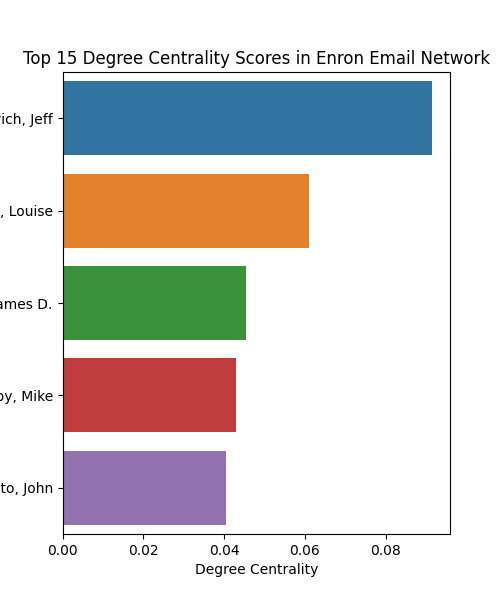

<header>
  <h1>Enron Network Analysis</h1>
  
Exploring the Enron dataset with Natural Language Processing

</header>

## Introduction

The Enron Email Dataset comprises approximately 500,000 emails from around 6,000 Enron employees, primarily executives, spanning 1998 to 2002. Released during the FERC investigation into Enron’s collapse, this corpus provides a unique window into corporate communications at a momentous moment in modern business history.

---

## Network Analysis

### Centrality Scores

Centrality measures quantify how “important” or well-connected a node is within the network. Here we look at degree, closeness, and eigenvector centralities to highlight the top communicators.

<figure class="network-visualization">
  
  <figcaption>Figure X. Top centrality scores.</figcaption>
</figure>

### Betweenness Score

Betweenness centrality shows which employees act as bridges on the shortest paths between others—key for detecting information bottlenecks.

<figure class="network-visualization">
  
  <figcaption>Figure Y. Nodes with highest betweenness.</figcaption>
</figure>

### Community Detection

Using the Louvain method, we partitioned the network into six densely-connected clusters, reflecting functional or departmental groupings within Enron.

<figure class="network-visualization">
  
  <figcaption>Figure Z. Enron email communities.</figcaption>
</figure>

---

## Further Investigation

Here you can outline additional analyses (NLP topic modeling, temporal dynamics, anomaly detection, etc.) or link to interactive dashboards.

---

## Key Statistics

  

    
140

    
Active Employees

  

  

    
16000

    
Emails

  

  

    
6

    
Detected Communities

  

---

## Contact

  <h2>Contact</h2>
  
This project was made by Christian Warburg (s225083) and Sofus Carstens (s22…) for the Computational Social Science course.

